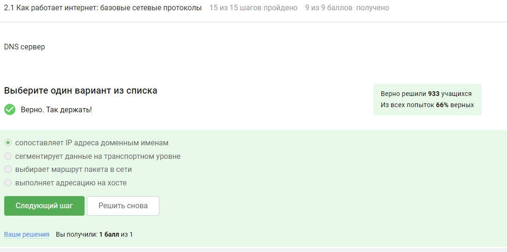
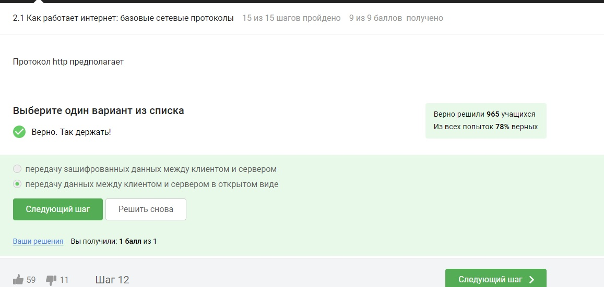
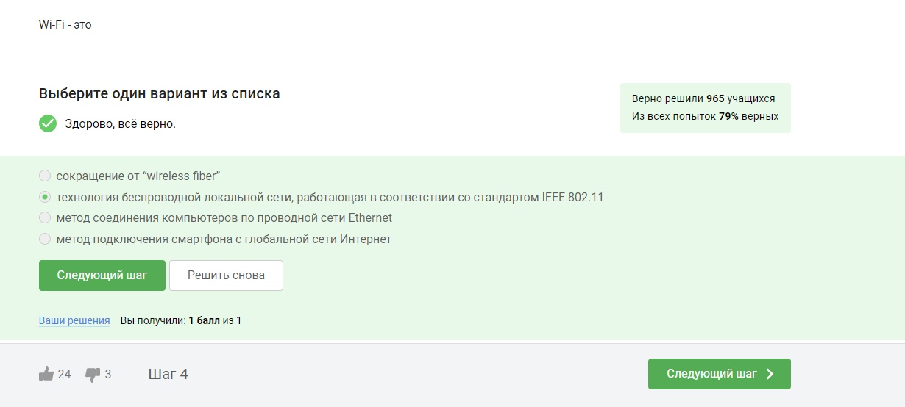
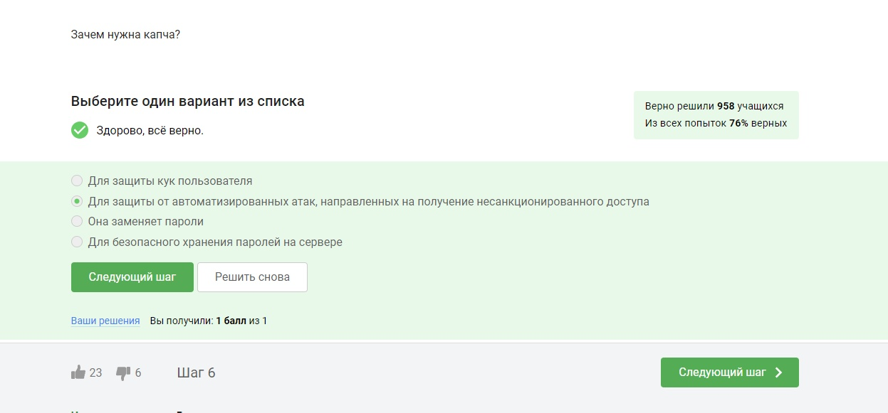
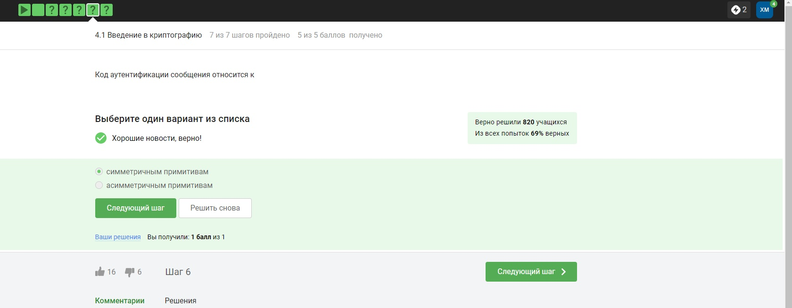
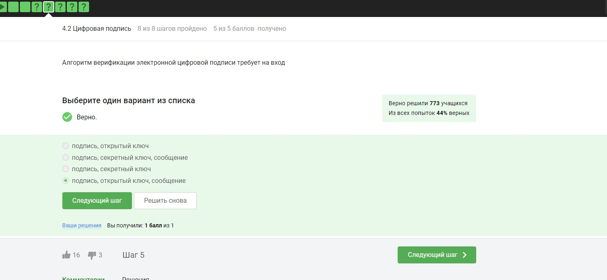

---
## Front matter
title: "Внешний курс на Stepik"
subtitle: "Основы кибербезопасности"
author: "Хватов Максим Григорьевич"

## Generic otions
lang: ru-RU
toc-title: "Содержание"

## Bibliography
bibliography: bib/cite.bib
csl: pandoc/csl/gost-r-7-0-5-2008-numeric.csl

## Pdf output format
toc: true # Table of contents
toc-depth: 2
lof: true # List of figures
lot: true # List of tables
fontsize: 12pt
linestretch: 1.5
papersize: a4
documentclass: scrreprt
## I18n polyglossia
polyglossia-lang:
  name: russian
  options:
	- spelling=modern
	- babelshorthands=true
polyglossia-otherlangs:
  name: english
## I18n babel
babel-lang: russian
babel-otherlangs: english
## Fonts
mainfont: PT Serif
romanfont: PT Serif
sansfont: PT Sans
monofont: PT Mono
mainfontoptions: Ligatures=TeX
romanfontoptions: Ligatures=TeX
sansfontoptions: Ligatures=TeX,Scale=MatchLowercase
monofontoptions: Scale=MatchLowercase,Scale=0.9
## Biblatex
biblatex: true
biblio-style: "gost-numeric"
biblatexoptions:
  - parentracker=true
  - backend=biber
  - hyperref=auto
  - language=auto
  - autolang=other*
  - citestyle=gost-numeric
## Pandoc-crossref LaTeX customization
figureTitle: "Рис."
tableTitle: "Таблица"
listingTitle: "Листинг"
lofTitle: "Список иллюстраций"
lotTitle: "Список таблиц"
lolTitle: "Листинги"
## Misc options
indent: true
header-includes:
  - \usepackage{indentfirst}
  - \usepackage{float} # keep figures where there are in the text
  - \floatplacement{figure}{H} # keep figures where there are in the text
---

# Цель работы

Закончить курс с сертификатом и научиться базовым приемам и методам информационной безопсности.

# Раздел 2.1

Выберите протокол прикладного уровня: HTTPS

{#fig:001 width=70%}

На каком уровне работает протокол TCP?: транспортном

{#fig:001 width=70%}

Выберите все корректные адреса IPv4: 90.11.90.22, 25.198.0.15

{#fig:001 width=70%}

DNS сервер: сопоставляет IP адреса доменным именам

{#fig:001 width=70%}

Выберите корректную последовательность протоколов в модели TCP/IP: прикладной -- транспортный -- сетевой -- канальный

{#fig:001 width=70%}

Протокол http предполагает: передачу данных между клиентом и сервером в открытом виде

{#fig:001 width=70%}

Протокол https состоит из: двух фаз: рукопожатия и передачи данных

{#fig:001 width=70%}

Версия протокола TLS определяется: и клиентом, и сервером в процессе “переговоров”

{#fig:001 width=70%}

В фазе “рукопожатия” протокола TLS не предусмотрено: шифрование данных

{#fig:001 width=70%}

# Раздел 2.2

Куки хранят: id сессии, идентификатор пользователя

{#fig:001 width=70%}

Куки не используются для: улучшения надежности соединения

{#fig:001 width=70%}

Куки генерируются: сервером

{#fig:001 width=70%}

Сессионные куки хранятся в браузере? Да, на время пользования веб-сайтом

{#fig:001 width=70%}

# Раздел 2.3

Сколько промежуточных узлов в луковой сети TOR? 3

{#fig:001 width=70%}

IP-адрес получателя известен: отправителю, выходному узлу

{#fig:001 width=70%}

Отправитель генерирует общий секретный ключ: с охранным, промежуточным и выходном узлом

{#fig:001 width=70%}

Должен ли получатель использовать браузер Tor (или другой браузер, основанный на луковой маршрутизации) для успешного получения пакетов? Нет

{#fig:001 width=70%}

# Раздел 2.4

Wi-Fi - это технология беспроводной локальной сети, работающая в соответствии со стандартом IEEE 802.11

{#fig:001 width=70%}

На каком уровне работает протокол WiFi? Канальном

{#fig:001 width=70%}

Небезопасный метод обеспечения шифрования и аутентификации в сети Wi-Fi WEP

{#fig:001 width=70%}

Данные между хостом сети (компьютером или смартфоном) и роутером: передаются в зашифрованном виде после аутентификации устройств

{#fig:001 width=70%}

Для домашней сети для аутентификации обычно используется метод: WPA2 Personal

{#fig:001 width=70%}

# Раздел 3.1. защита ПК и телефона

Можно ли зашифровать загрузочный сектор диска: да

{#fig:001 width=70%}

Шифрование диска основано на: симметричном шифровании

{#fig:001 width=70%}

С помощью каких программ можно зашифровать жесткий диск?:BitLocker, VeraCrypt

{#fig:001 width=70%}

# Раздел 3.2. Пароли

Какие пароли можно отнести с стойким? UQr9@j4!S$
{#fig:001 width=70%}

Где безопасно хранить пароли? В менеджерах паролей
{#fig:001 width=70%}

Зачем нужна капча?Для защиты от автоматизированных атак, направленных на получение несанкционированного доступа
{#fig:001 width=70%}

Для чего применяется хэширование паролей?Для того, чтобы не хранить пароли на сервере в открытом виде.
{#fig:001 width=70%}

Поможет ли соль для улучшения стойкости паролей к атаке перебором, если злоумышленник получил доступ к серверу? Нет
{#fig:001 width=70%}

Какие меры защищают от утечек данных атакой перебором?

- разные пароли на всех сайтах
- периодическая смена паролей
- сложные(=длинные) пароли
- капча
{#fig:001 width=70%}

# Раздел 3.3. Фишинг

Какие из следующих ссылок являются фишинговыми?
- https://online.sberbank.wix.ru/CSAFront/index.do (вход в Сбербанк.Онлайн)
- https://passport.yandex.ucoz.ru/auth?origin=home_desktop_ru (вход в аккаунт Яндекс)

{#fig:001 width=70%}

Может ли фишинговый имейл прийти от знакомого адреса? да
{#fig:001 width=70%}

# Раздел 3.3. Вирусы. Примеры

Email Спуфинг -- это подмена адреса отправителя в имейлах
{#fig:001 width=70%}

Вирус-троян маскируется под легитимную программу
{#fig:001 width=70%}

# Раздел 3.5. Безопасность мессенджеров

На каком этапе формируется ключ шифрования в протоколе мессенджеров Signal?

- при генерации первого сообщения стороной-отправителем
{#fig:001 width=70%}

Суть сквозного шифрования состоит в том, что

- сообщения передаются по узлам связи (серверам) в зашифрованном виде
{#fig:001 width=70%}

# Раздел 4.1 Введение в криптографию

В асимметричных криптографических примитивах
- обе стороны имеют пару ключей
{#fig:001 width=70%}

Криптографическая хэш-функция
- стойкая к коллизиям
- дает на выходе фиксированное число бит независимо от объема входных данных
- эффективно вычисляется
{#fig:001 width=70%}

К алгоритмам цифровой подписи относятся
- RSA
- ECDSA
- ГОСТ Р 34.10-2012.
{#fig:001 width=70%}

Код аутентификации сообщения относится к
- симметричным примитивам
{#fig:001 width=70%}

Обмен ключам Диффи-Хэллмана - это
-асимметричный примитив генерации общего секретного ключа
{#fig:001 width=70%}

# Раздел 4.2 Цифровая подпись

Протокол электронной цифровой подписи относится к
- протоколам с публичным (или открытым) ключом
{#fig:001 width=70%}

Алгоритм верификации электронной цифровой подписи требует на вход
- подпись, открытый ключ, сообщение
{#fig:001 width=70%}

Электронная цифровая подпись не обеспечивает
-конфиденциальность
{#fig:001 width=70%}

Какой тип сертификата электронной подписи понадобится для отправки налоговой отчетности в ФНС?
-усиленная квалифицированная
{#fig:001 width=70%}

В какой организации вы можете получить квалифицированный сертификат ключа проверки электронной подписи?
-в удостоверяющем (сертификационном) центре
{#fig:001 width=70%}

# Раздел 4.3 Электронные платежи

Выберите из списка все платежные системы.
- MasterCard
- МИР
{#fig:001 width=70%}

Примером многофакторной аутентификации является
- комбинация проверка пароля + код в sms сообщении
- комбинация код в sms сообщении + отпечаток пальца
{#fig:001 width=70%}

При онлайн платежах сегодня используется
- многофакторная аутентификация покупателя перед банком-эмитентом
{#fig:001 width=70%}

# Раздел 4.4 Блокчейн

Какое свойство криптографической хэш-функции используется в доказательстве работы?
- сложность нахождения прообраза
{#fig:001 width=70%}

Консенсус в некоторых системах блокчейн обладает свойствами
- открытость
- консенсус
- постоянства
- живучесть
{#fig:001 width=70%}

Секретные ключи какого криптографического примитива хранят участники блокчейна?
- цифровая подпись
{#fig:001 width=70%}

# Вывод

Курс пройден, сертификат не выдаётся на этом курсе. Я научился основным методам информационной безопасности
{#fig:001 width=70%}
